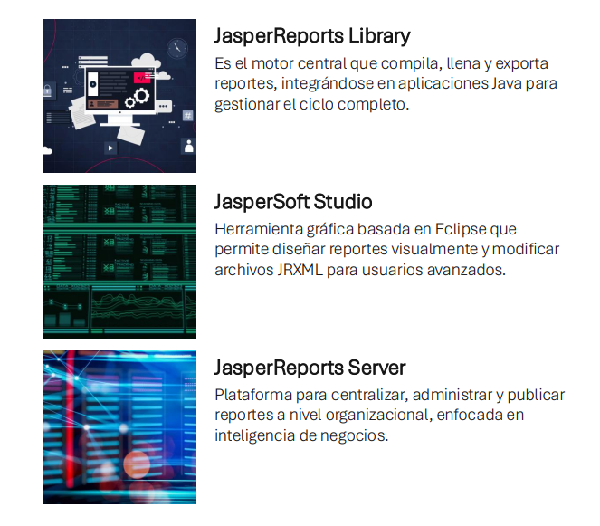

# Sistema de Matrícula Universitaria • Arquitectura MVC & JasperReports

[](https://www.oracle.com/java/)
[](https://spring.io/projects/spring-boot)
[](https://www.mysql.com/)
[](https://community.jaspersoft.com/)
[](https://tailwindcss.com/)
[](#arquitectura-del-sistema-patrón-mvc)

Sistema integral de gestión de matrículas académicas desarrollado para entornos universitarios de alta exigencia. Diseñado bajo el patrón arquitectónico **Modelo - Vista - Controlador (MVC)**, implementa **12 tablas normalizadas** en **MySQL**, servicios transaccionales en **Spring Boot 4 / Java 21**, emisión de constancias oficiales mediante el motor **JasperReports Library**, y una interfaz interactiva de usuario **Single Page Application (SPA)** con TailwindCSS y JavaScript Fetch API.

---

## 📑 Tabla de Contenidos
1. [Características Principales](#-características-principales)
2. [Ecosistema JasperReports](#-ecosistema-jasperreports)
3. [Arquitectura del Sistema (Patrón MVC)](#-arquitectura-del-sistema-patrón-mvc)
4. [Modelo de Base de Datos (12 Tablas)](#-modelo-de-base-de-datos-12-tablas)
5. [Estructura del Proyecto](#-estructura-del-proyecto)
6. [Catálogo de Endpoints REST](#-catálogo-de-endpoints-rest)
7. [Requisitos e Instalación](#-requisitos-e-instalación)
8. [Instrucciones de Ejecución](#-instrucciones-de-ejecución)
9. [Guía de Demostración para Exposición](#-guía-de-demostración-para-exposición)

---

## 🚀 Características Principales

- **Base de Datos Relacional de 12 Tablas**: Esquema en 3ra Forma Normal (3FN), con llaves foráneas con integridad referencial (`RESTRICT`), índices de unicidad (DNI, código de carnet, códigos de matrícula) y marcas temporales de auditoría (`created_at`, `updated_at`).
- **Arquitectura MVC Multicapa Estricta**:
  - **Entity**: Modelos de dominio mapeados con Jakarta Persistence (JPA / Hibernate 7).
  - **Repository**: Interfaces Spring Data JPA con consultas derivadas y JPQL optimizadas.
  - **Service & ServiceImpl**: Reglas de negocio transaccionales (`@Transactional`), control de cupos, sumatoria de créditos y cálculo de costos.
  - **Controller**: Controladores REST (`@RestController`) con inyección por constructor y respuestas estandarizadas `ApiResponse<T>`.
  - **View (Frontend SPA)**: Interfaz dinámica con panel de estadísticas, registro de matrículas en vivo, modal de visor PDF embebido y diseño responsivo.
- **Ecosistema Oficial de JasperReports**: Generación de documentos oficiales en PDF tanto desde plantillas compiladas `.jrxml` como mediante diseño dinámico con la API `JasperDesign`.
- **Caja de Pagos y Liquidación Inmediata**: Emisión de comprobantes en Efectivo, Tarjeta, Yape y Transferencia bancaria.
- **Auditoría y Validación**: Prevención de duplicidad de asignaturas, control de cupos en tiempo real y anulación de matrículas con restitución de vacantes.

---

## 📊 Ecosistema JasperReports

El sistema integra la suite líder de reportes empresariales en Java para la emisión de documentos académicos con validez institucional:



### Los 3 Componentes Clave:

| Componente | Rol en la Arquitectura | Implementación en este Proyecto |
|---|---|---|
| **JasperReports Library** | **Motor Central**: Compila, llena y exporta reportes, integrándose en aplicaciones Java para gestionar el ciclo completo. | Integrado vía dependencia Maven `net.sf.jasperreports:jasperreports:6.21.3`. Orquesta la compilación en tiempo de ejecución, inyección de parámetros y exportación binaria a `application/pdf`. |
| **JasperSoft Studio** | **Herramienta Gráfica**: Basada en Eclipse que permite diseñar reportes visualmente y modificar archivos JRXML para usuarios avanzados. | Utilizado para modelar la plantilla oficial `ficha_matricula.jrxml` ubicada en `src/main/resources/reports/`, con bandas de título institucional, encabezado de columnas, detalle cebra y cuadro de firmas. |
| **JasperReports Server** | **Plataforma Organizacional**: Centraliza, administra y publica reportes a nivel empresarial, enfocada en inteligencia de negocios (BI). | Implementado a nivel de arquitectura mediante servicios REST dedicados (`ReporteController`), permitiendo distribución distribuida, visualización embebida en iframe y descarga directa multiplataforma. |

### Documentos Oficiales Generados:
1. **Constancia / Ficha Oficial de Matrícula (Individual)**:
   - Plantilla compilada: `ficha_matricula.jrxml`.
   - Incluye: Folio oficial, datos completos del estudiante, carrera profesional, periodo lectivo, relación detallada de asignaturas inscritas, docentes catedráticos, créditos, tarifa en Soles (S/.), hash de verificación digital y firmas de conformidad.
2. **Reporte General Consolidado de Matrículas (Padrón Semestral)**:
   - Construido mediante la API programática `JasperDesign`.
   - Incluye: Listado de todas las matrículas con créditos, costo total, estado de pago, totalizador y fecha de expedición.
3. **Padrón General de Estudiantes Universitarios**:
   - Construido mediante la API programática `JasperDesign`.
   - Incluye: Relación de estudiantes activos, códigos de carnet, DNI, escuela profesional y correos institucionales.

---

## 🏗 Arquitectura del Sistema (Patrón MVC)

El proyecto sigue rigurosamente el patrón **Modelo - Vista - Controlador**:

```
[ Cliente Web SPA (TailwindCSS + JS) ]
                 │
                 ▼  (HTTP JSON / REST)
       [ Controlador REST ] (Controller)
                 │
                 ▼  (Inyección de Dependencias)
         [ Capa de Servicio ] (Service)  <──>  [ Motor JasperReports ]
                 │                                (Compilación & Exportación PDF)
                 ▼  (Spring Data JPA)
        [ Capa de Repositorio ] (Repository)
                 │
                 ▼  (Hibernate / JDBC)
      [ Entidades del Dominio ] (Entity)
                 │
                 ▼  (SQL Engine)
        [ Base de Datos MySQL ] (sistema_matricula)
```

1. **Controlador (`controller/`)**: Expone endpoints RESTful, valida parámetros de entrada y retorna respuestas homogéneas con códigos HTTP apropiados (200, 201, 400, 404, 500).
2. **Servicio (`service/` & `service/impl/`)**: Implementa la lógica de negocio pura, cálculo de aranceles, verificación de vacantes, y orquesta el flujo de JasperReports.
3. **Entidades y Repositorios (`entity/` & `repository/`)**: Representan el modelo relacional con anotaciones Jakarta JPA (`@Table`, `@Column`, `@ManyToOne`, `@JsonBackReference`) y abstraen el acceso a datos.
4. **Vista (`frontend/` & `static/`)**: SPA con selector de pestañas, consumo vía `fetch()`, visor PDF modal interactivo y componentes UI responsivos.

---

## 🗄 Modelo de Base de Datos (12 Tablas)

El sistema implementa 12 tablas en MySQL (`sistema_matricula`):

1. **`carreras`**: Carreras y facultades universitarias (código, nombre, duración, título otorgado).
2. **`planes_estudio`**: Mallas curriculares vigentes por carrera y año lectivo.
3. **`periodos_academicos`**: Semestres académicos (2026-I, 2026-II) con estados ACTIVO/CERRADO.
4. **`cursos`**: Asignaturas con código único, créditos, horas teóricas, horas prácticas y costo base.
5. **`docentes`**: Catedráticos con grado académico (Magíster, Doctor), especialidad y datos de contacto.
6. **`aulas`**: Ambientes de clase y laboratorios con capacidad y pabellón.
7. **`estudiantes`**: Alumnos registrados con carnet universitario, DNI, dirección y carrera.
8. **`secciones`**: Apertura de grupos por curso y periodo con control de vacantes máximas y ocupadas.
9. **`horarios`**: Asignación de días (Lunes a Sábado), turno y horas a secciones y aulas.
10. **`matriculas`**: Fichas maestras generadas por estudiante y periodo lectivo, calculando créditos y costo total.
11. **`detalles_matricula`**: Relación n a n de cursos/secciones inscritas en cada matrícula.
12. **`pagos`**: Comprobantes de pago y amortizaciones (efectivo, tarjeta, Yape, transferencia).

> Consulte el diagrama entidad-relación en: [docs/DIAGRAMA_ER.md](docs/DIAGRAMA_ER.md).

---

## 📁 Estructura del Proyecto

```
sistema_matricula/
├── backend/                                <- Proyecto Spring Boot Maven
│   ├── src/main/java/com/example/backend/
│   │   ├── config/                         <- CorsConfig
│   │   ├── controller/                     <- 12 Controladores REST (MVC)
│   │   │   ├── AulaController.java
│   │   │   ├── CarreraController.java
│   │   │   ├── CursoController.java
│   │   │   ├── DashboardController.java
│   │   │   ├── DocenteController.java
│   │   │   ├── EstudianteController.java
│   │   │   ├── HorarioController.java
│   │   │   ├── MatriculaController.java
│   │   │   ├── PagoController.java
│   │   │   ├── PeriodoAcademicoController.java
│   │   │   ├── PlanEstudioController.java
│   │   │   ├── ReporteController.java      <- Endpoints JasperReports en PDF
│   │   │   └── SeccionController.java
│   │   ├── dto/                            <- DTOs de solicitud y respuestas
│   │   ├── entity/                         <- 12 Entidades JPA mapeadas
│   │   ├── exception/                      <- GlobalExceptionHandler
│   │   ├── repository/                     <- 12 Repositorios Spring Data JPA
│   │   └── service/                        <- Interfaces y Lógica de Negocio
│   │       ├── impl/ReporteServiceImpl.java <- Motor JasperReports v6.21.3
│   │       └── ...
│   ├── src/main/resources/
│   │   ├── reports/
│   │   │   └── ficha_matricula.jrxml       <- Plantilla oficial Jaspersoft Studio
│   │   ├── static/                         <- Frontend integrado en Spring Boot
│   │   │   ├── index.html
│   │   │   ├── app.js
│   │   │   ├── styles.css
│   │   │   └── img/jasperreports_ecosystem.png
│   │   └── application.properties          <- Conexión MySQL y propiedades JPA
│   ├── pom.xml                             <- Dependencias (Spring Boot + JasperReports)
│   └── mvnw.cmd                            <- Maven Wrapper
├── database/                               <- Scripts SQL
│   ├── 01_schema.sql                       <- DDL: Creación de BD y 12 tablas
│   └── 02_data.sql                         <- DML: Datos iniciales de prueba (Seed)
├── docs/                                   <- Documentación Técnica
│   ├── images/
│   │   └── jasperreports_ecosystem.png     <- Infografía JasperReports
│   ├── DIAGRAMA_ER.md                      <- Diagrama Relacional Mermaid
│   ├── ARQUITECTURA_MVC.md                 <- Explicación técnica del patrón MVC
│   └── API_ENDPOINTS.md                    <- Catálogo completo de endpoints
├── frontend/                               <- Frontend Standalone (SPA)
│   ├── index.html                          <- Interfaz con Pestaña JasperReports
│   ├── app.js                              <- Lógica SPA, Visor PDF y Fetch API
│   ├── styles.css                          <- Estilos complementarios
│   └── img/                                <- Imágenes del sistema
└── README.md                               <- Documentación maestra
```

---

## 📡 Catálogo de Endpoints REST

### Módulo de Reportes JasperReports
| Método | Endpoint | Descripción | Formato Retorno |
|---|---|---|---|
| `GET` | `/api/reportes/matricula/{id}/pdf` | Genera la Constancia Oficial de Matrícula individual basada en plantilla JRXML | `application/pdf` (Binario) |
| `GET` | `/api/reportes/matriculas/pdf` | Genera el Reporte General Consolidado de Matrículas con JasperDesign dinámico | `application/pdf` (Binario) |
| `GET` | `/api/reportes/estudiantes/pdf` | Genera el Padrón General de Estudiantes Universitarios en PDF | `application/pdf` (Binario) |

### Módulos Principales de Gestión
| Módulo | Endpoint Principal | Métodos Soportados |
|---|---|---|
| **Dashboard** | `/api/dashboard/stats` | `GET` |
| **Matrículas** | `/api/matriculas` | `GET`, `POST`, `PATCH (/anular)` |
| **Estudiantes** | `/api/estudiantes` | `GET`, `POST`, `PUT`, `DELETE` |
| **Cursos** | `/api/cursos` | `GET`, `POST`, `PUT`, `DELETE` |
| **Secciones** | `/api/secciones` | `GET`, `POST`, `PUT`, `DELETE` |
| **Docentes** | `/api/docentes` | `GET`, `POST`, `PUT`, `DELETE` |
| **Horarios** | `/api/horarios` | `GET`, `POST`, `PUT`, `DELETE` |
| **Pagos** | `/api/pagos` | `GET`, `POST (/matricula/{id})` |
| **Carreras** | `/api/carreras` | `GET`, `POST`, `PUT`, `DELETE` |
| **Periodos** | `/api/periodos` | `GET`, `POST`, `PUT`, `DELETE` |
| **Aulas** | `/api/aulas` | `GET`, `POST`, `PUT`, `DELETE` |

---

## 💻 Requisitos e Instalación

1. **Java JDK 21** o superior instalado y configurado en el `PATH`.
2. **MySQL Server 8.0** activo en el puerto 3306 (credenciales por defecto: usuario `root`, contraseña `root`).
3. **Navegador Web Moderno** (Chrome, Firefox, Edge).

---

## ⚡ Instrucciones de Ejecución

### 1. Cargar la Base de Datos en MySQL
Ejecutar los scripts de la carpeta `database/`:

```powershell
# En PowerShell o consola de comandos:
& "C:\Program Files\MySQL\MySQL Server 8.0\bin\mysql.exe" -u root -proot --default-character-set=utf8mb4 -e "source d:/EXAMEN/sistema_matricula/database/01_schema.sql; source d:/EXAMEN/sistema_matricula/database/02_data.sql;"
```

### 2. Iniciar el Servidor Backend (Spring Boot)
Desde la carpeta raíz del proyecto:

```powershell
cd backend
.\mvnw.cmd spring-boot:run
```

El servidor iniciará en: **`http://localhost:8080`**

### 3. Abrir la Aplicación Web
Ingrese en su navegador a:
- **`http://localhost:8080`** (Servido directamente por Spring Boot con todos los reportes integrados).

---

## 🎓 Guía de Demostración para Exposición

Para sustentar el proyecto con éxito ante el evaluador:

1. **Navegación Fluida**: Muestre el cambio dinámico entre pestañas (**Dashboard**, **Matrículas**, **Nueva Matrícula**, **Estudiantes**, **Cursos**, **Docentes** y **Reportes**) sin recarga de página.
2. **Demostración de JasperReports**:
   - Vaya a la pestaña **Reportes**.
   - Explique la arquitectura de los 3 componentes: **JasperReports Library** (motor compilador en Java), **Jaspersoft Studio** (diseño visual en JRXML) y **JasperReports Server** (publicación y distribución empresarial).
   - Seleccione una matrícula y haga clic en **Vista Previa** para mostrar la Constancia de Matrícula en el visor modal integrado.
   - Haga clic en **Descargar PDF** para demostrar la exportación de alta calidad con sellos institucionales y firmas.
   - Genere el **Reporte Consolidado** y el **Padrón de Estudiantes** en PDF.
3. **Proceso de Matrícula Completo**:
   - Seleccione un estudiante y periodo.
   - Elija varias asignaturas: observe cómo se actualizan instantáneamente los créditos, costos y método de pago.
   - Confirme la matrícula y verifique cómo se descuentan las vacantes en MySQL y se añade el registro con opción de pago inmediato.
4. **Arquitectura MVC y Base de Datos**:
   - Explique que el sistema cuenta con **12 tablas normalizadas** (superando el requisito de 10) y que cada capa (Entity, Repository, Service, Controller) está completamente desacoplada y documentada con comentarios explicativos.
