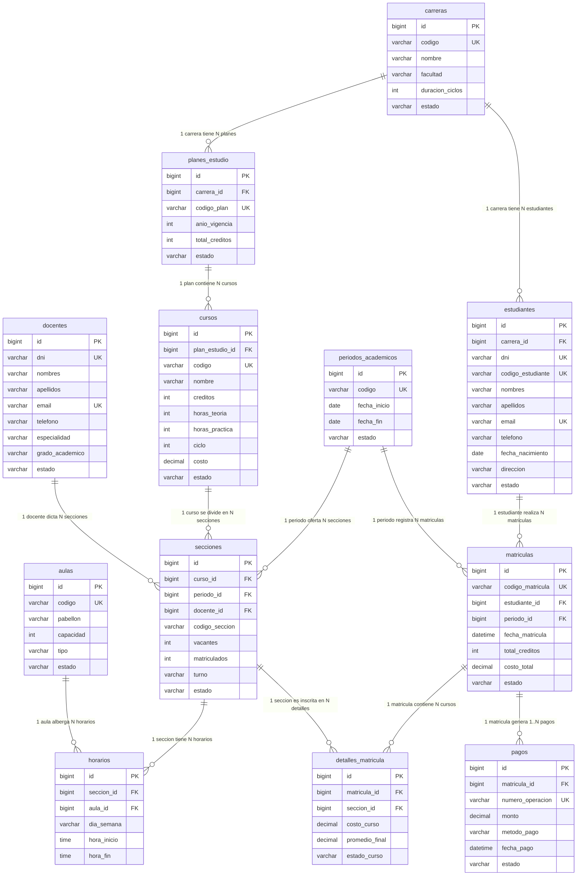

# Diagrama Entidad - Relación (12 Tablas)
## Sistema de Matrícula Académica Universitaria

El sistema de matrícula está modelado con **12 tablas relacionales normalizadas** en 3ra Forma Normal (3FN), garantizando integridad referencial, consistencia de datos y rendimiento óptimo.

---

### Resumen de Cardinalidades e Integridad
1. **Carreras & Planes de Estudio**: Una carrera profesional ofrece uno o varios planes de estudio a lo largo del tiempo.
2. **Planes de Estudio & Cursos**: Un plan de estudios define la malla curricular de cursos por ciclo.
3. **Cursos & Secciones**: Para cada periodo lectivo, una asignatura puede abrir múltiples secciones (A, B, C...) con límites de vacantes.
4. **Secciones & Horarios / Aulas**: Cada sección posee horarios en días específicos asignados a aulas físicas o laboratorios.
5. **Estudiantes & Matrículas**: Un estudiante se matricula una única vez por cada periodo académico (semestre).
6. **Matrículas & Detalles**: Una matrícula asocia al alumno con múltiples secciones de asignaturas elegidas, calculando créditos acumulados y costo total.
7. **Matrículas & Pagos**: La matrícula genera un registro financiero o comprobante de pago con métodos como tarjeta, efectivo, transferencia o Yape.
